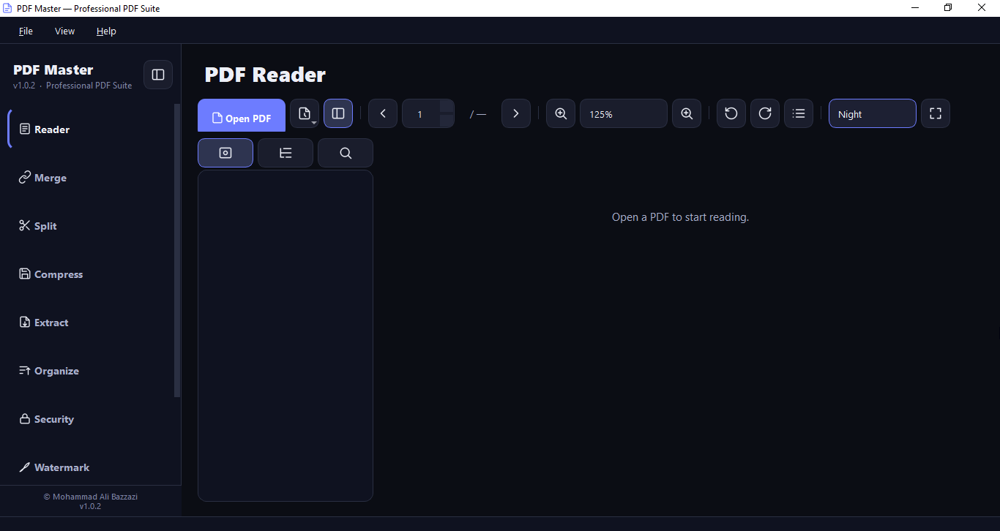
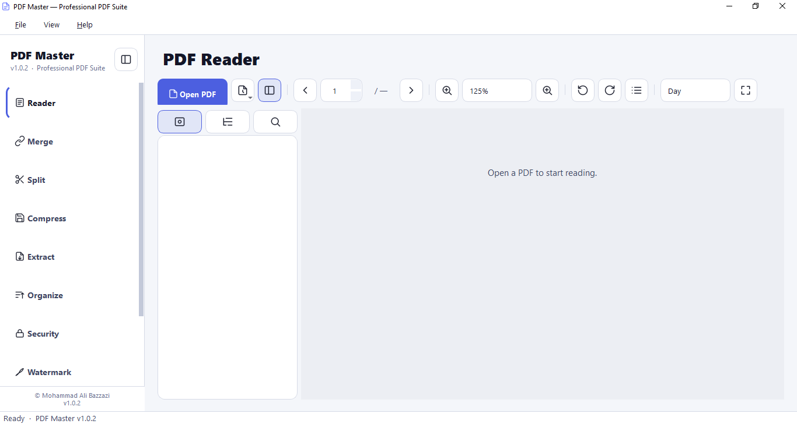
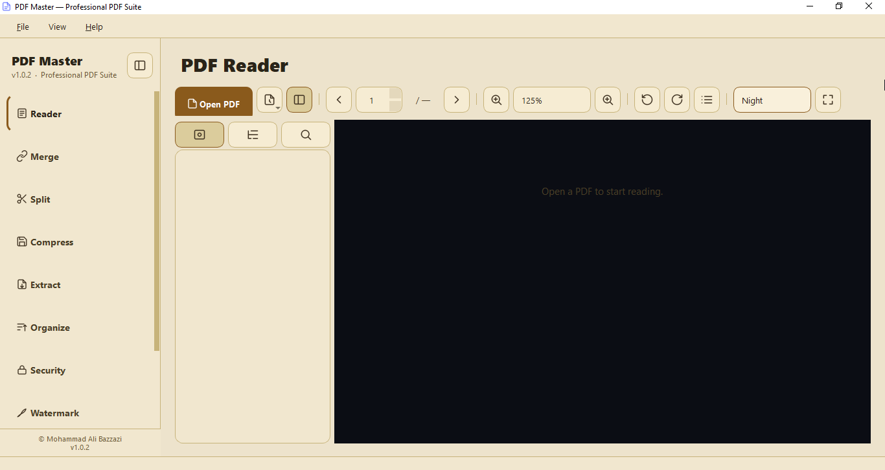

# PDF Master

<p align="center">
  
</p>

<p align="center">
  <strong>Professional PDF management suite with a modern interface, three visual themes, and a complete toolset for everyday document workflows.</strong>
</p>

<p align="center">
  
  
  
  
  
</p>

---

## Overview

**PDF Master** is a desktop application for viewing, organizing, editing, and processing PDF files. It is built with **PyQt5** and designed to feel fast, clean, and practical for daily use.

The interface includes three polished themes — **Dark**, **Light**, and **Sepia** — with a focus on readability, consistency, and a modern visual style.

---

## Screenshots

<table>
  <tr>
    <td width="33%" align="center">
      
      <br><strong>Dark</strong>
    </td>
    <td width="33%" align="center">
      
      <br><strong>Light</strong>
    </td>
    <td width="33%" align="center">
      
      <br><strong>Sepia</strong>
    </td>
  </tr>
</table>

---

## Features

- Smooth PDF viewing and page navigation
- Text search inside documents
- Zoom, rotation, and page movement
- Merge multiple PDFs into one file
- Split PDFs by page or page range
- Compress PDF files
- Extract text and embedded images
- Organize pages and save a new version
- Encrypt and decrypt PDF documents
- Add watermark text to every page
- View and edit document metadata
- English and Persian language support
- Modern multi-theme interface

---

## Releases

### Version 1.0.1
This release focuses on visual consistency, usability, and a more polished reading experience.

Highlights:

- More than 90 custom SVG icons in the `icons/` folder
- Animated loading state while opening large PDFs
- Cleaner toolbar layout with fewer unnecessary controls
- Dedicated icons for previous/next page navigation
- Better performance with large documents
- Themed context menu behavior and improved fullscreen stability

---

## Installation

```bash
pip install -r requirements.txt
python pdf_master.py
```

---

## Build an Executable

### PyInstaller

```bash
pyinstaller --noconfirm --clean --onefile --windowed --icon=icon.ico --add-data "icons;icons" --name "PDF Master" pdf_master.py
```

On Windows, use `;` as the separator.
On Linux and macOS, use `:` instead.

### Linux / macOS example

```bash
pyinstaller --noconfirm --clean --onefile --windowed --icon=icon.ico --add-data "icons:icons" --name "PDF Master" pdf_master.py
```

---

## Project Structure

```text
PDF-Master/
├── pdf_master.py
├── icon.ico
├── icons/
│   └── ...
├── Screenshots/
│   ├── dark.png
│   ├── light.png
│   └── sepia.png
└── README.md
```

---

## Technology Stack

- Python
- PyQt5
- PyMuPDF
- pypdf
- PyInstaller

---

## Author

**Mohammad Ali Bazzazi**  
GitHub: `bazzazi`

---

## License

All rights reserved.
